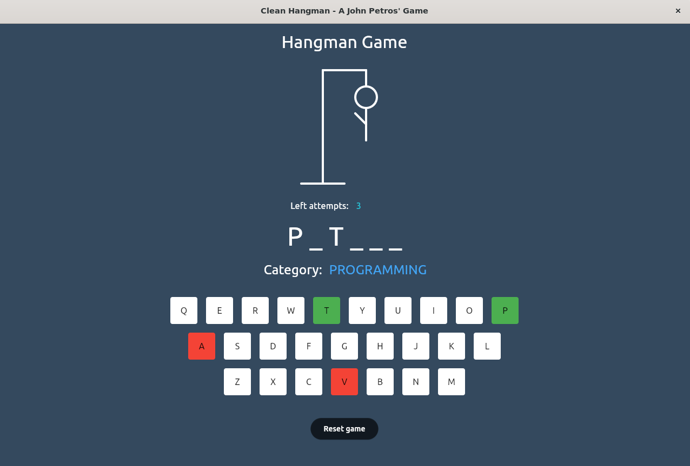

<h1 align="center">
  Clean Hangman ➰
</h1>

<div align="center">
   <a href="https://github.com/JohnPetros">
      
   </a>
   
   <a href="https://github.com/JohnPetros/clean-hangman/commits/main">
      
   </a>
  </a>
   </a>
   <a href="https://github.com/JohnPetros/clean-hangman/blob/main/LICENSE.md">
      
   </a>
    
</div>
<br>

## 🖥️ About the project

**Hangman** is a classic game in which the player guesses a word of a certain category within a limited number of attempts.

The base code itself follows the concepts of **[Clean Architecture](https://www.freecodecamp.org/news/a-quick-introduction-to-clean-architecture-990c014448d2/)** proposed by [Uncle Bob](http://cleancoder.com/products) in [his book](https://www.amazon.com.br/Clean-Architecture-Craftsmans-Software-Structure/dp/0134494164). Therefore, it conscerns to separate the core business logic (rules of the game) from any external factors like frameworks, libraries, environment, and UI. This separation consequently enhaces the maintainability, scalability and testability of the project in the long run.

The project is divided into three packages: core, **[CLI](https://www.w3schools.com/whatis/whatis_cli.asp)** and **[GUI](https://www.geeksforgeeks.org/what-is-graphical-user-interface/)**. So, this allows user to choose their preferred application for playing the game, whether by command-line interface or graphical interface.

### ⏹️ Preview

<table align="center">
  <tr>
    <td align="center">
      <span>Command-line Interface<br/></span>
      
    </td>
  </tr>  
   <tr>
    <td align="center" >
      <span>Graphical Interface<br/></span>
      
    </td>
  </tr>  
</table>


---

## ✨ Features

- [x] User should choose the category from which a random word will be generated by the app
- [x] User should have up to five attempts to get the word correct:
- [x] User should be able to reset the running game at any time
- [x] App should add a limb to Hangman for each incorrect user guess
- [x] App should display the user's left attempt count
- [x] App should prevent already used letters
- [x] App should display what letters are correct and incorrect throughout the game
- [x] App should display a end game message to user, adapting it based on whether user won or not
- [x] App should validate any input from user, displaying an error message if any
- [x] GUI app should listen to keyboard click and press events

---

## ⚙️ Archtecture

### 📦 Packages

- [Core](https://github.com/JohnPetros/clean-hangman/tree/main/packages/core) for protecting and encapsulating all the rules of the hangman game

- [CLI](https://github.com/JohnPetros/clean-hangman/tree/main/packages/cli) throughout the entire CLI application codebase.

- [GUI](https://github.com/JohnPetros/clean-hangman/tree/main/packages/gui) throughout the entire GUI application codebase.

### 🛠️ Technologies

This project was developed using the technologies bellow:

- ✔️ **[Python](https://www.python.org/)** for writing the code of all applications

- ✔️ **[Typer](https://typer.tiangolo.com/)** for building the CLI application

- ✔️ **[Rich](https://rich.readthedocs.io/en/stable/introduction.html)** for writing [rich text](https://www.contentful.com/developers/docs/concepts/rich-text/#:~:text=Rich%20Text%20is%20a%20field,pure%20JSON%20rather%20than%20HTML.) to the terminal, and for displaying advanced content such as tables

- ✔️ **[Flet](https://flet.dev/)** for building multi-plataform GUI application powered by Flutter

> For more details on the projects dependencies like specific versions check out the [package.json file](https://github.com/JohnPetros/clean-hangman/blob/main/package.json)

---

## 🚀 How to run the application

### 🔧 Prerequisitives


- [Git](https://git-scm.com/) for manipulating Git repositories
- [Python](https://www.python.org/) for installing the dependencies and running the application using [pip](https://www.w3schools.com/python/python_pip.asp), the official packange manager for Python.

> Also it is good to have a code editor like [VSCode](https://code.visualstudio.com/) if you feel like writing the code base for any reason.

### 🏗️ Setup the project

```bash

# Clone this repository
git clone https://github.com/JohnPetros/clean-hangman.git

# Access the project directory
cd clean-hangman

```

### 🖥️ Running the application

#### Using script 📟

```bash

# For Linux
chmod +x start-app.sh

./start-app.sh start # For starting the CLI application
./start-app.sh gui # For starting the GUI application


# For Windows
icacls start-app.bat /grant Everyone:F

start-app.bat start # For starting the CLI application
start-app.bat gui # For starting the GUI application
```

#### Using Docker 🐳

```bash

# CLI app
docker run --it joaopetros/clean-hangman:2.0 start

# GUI app
docker run --port 8000:46857 joaopetros/clean-hangman:2.0 gui

```

> The GUI application will be running on localhost:8000

---

## Deploy 🚚 


### 📦 Bundle

The executable bundle of the app are available to download for:

- [Linux](https://github.com/JohnPetros/clean-hangman/releases/download/0.0.4/tradutor_ubuntu.zip)
- [Windows](https://github.com/JohnPetros/clean-hangman/releases/download/0.0.4/tradutor_windows.zip)

### 🖥️ Site

The GUI web application can be used online by [https://clean-hangman.onrender.com/](https://clean-hangman.onrender.com/) which is hosted by [Render plataform](https://dashboard.render.com/) via Docker container.

---

## 💪 How to contribute

```bash

# Fork this repository
$ git clone https://github.com/JohnPetros/clean-hangman.git

# Create a branch for your feature
$ git checkout -b my-feature

# Commit your changes
$ git commit -m ' ✨feat: my feature'

# Push your branch
$ git push origin my-feature

```

> You should replace 'my-feature' wuth your feature's name that you adding

> You can also open a [new issue](https://github.com/JohnPetros/clean-hangman/issues) reporting some problem, question or sugestion about the project. I will really be glad to help and improve this project as well 

---

## 📝 Licence

This application is under MIT licence. See the [licence file](LICENSE) to obtain more details about it

---

<p align="center">
  Made with 💜 by John Petros 👋🏻
</p>
